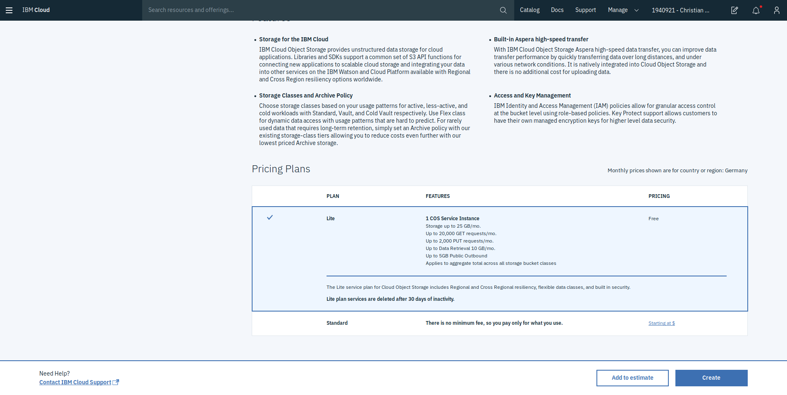
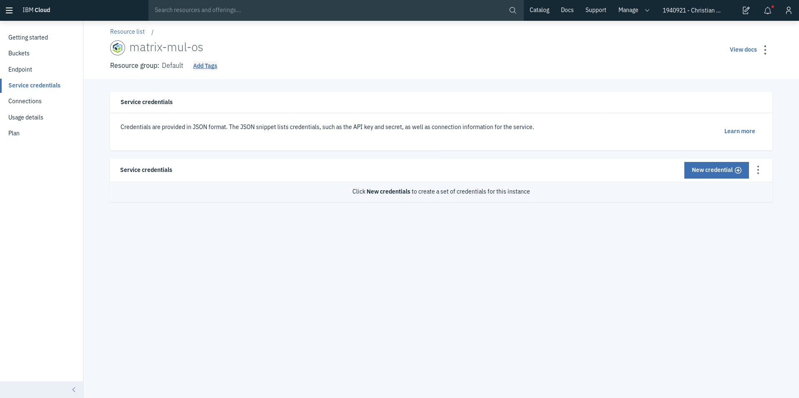
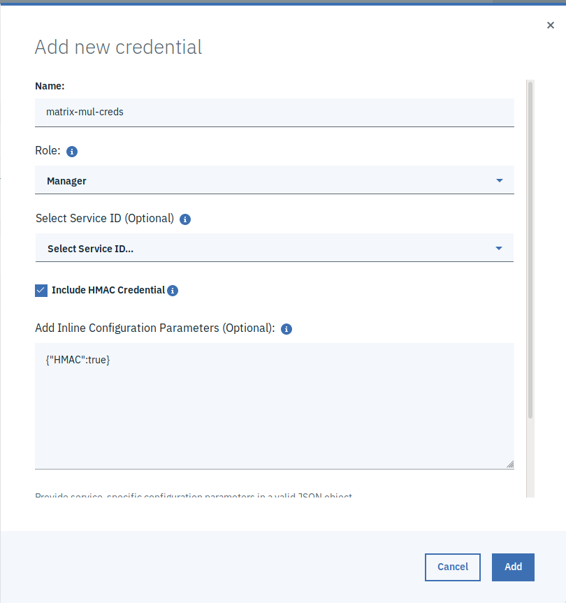
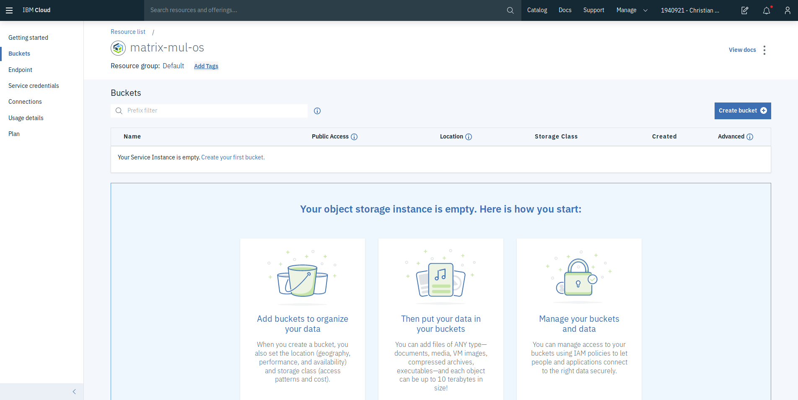
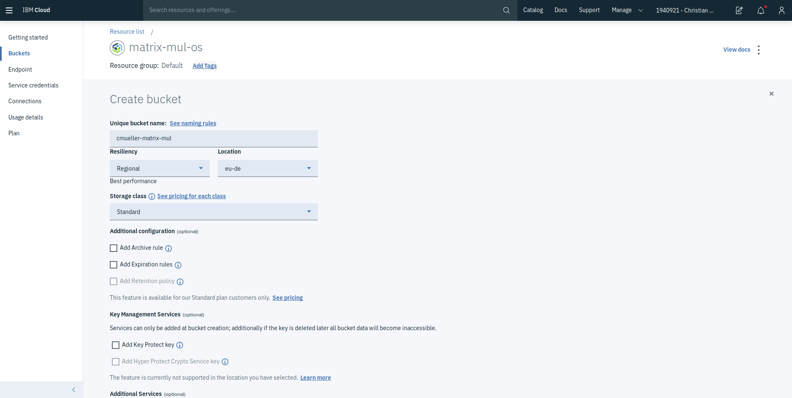
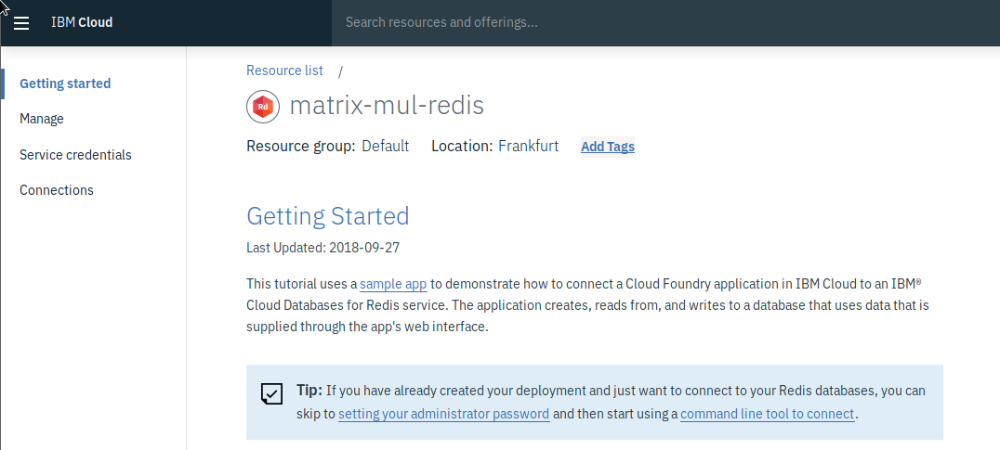
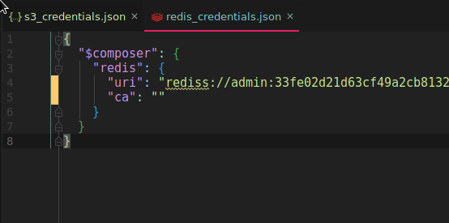
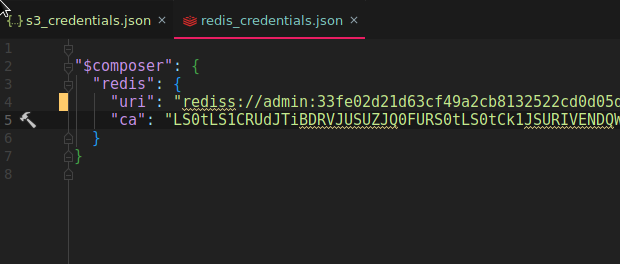

# Matrix Multiplication - IBM Cloud Implementation

## Prerequisites

Since the automated creation of resources does not work as expected all the time we have to create the services used by this application manually. These beeing the Object Storage and the Redis instance needed for parallel execution.

## Initializing Object Storage

### Step 1: Create Object Storage Instance

Search for "object storage" and select it.

Assign a name to the object storage instance and choose a plan. Once done click "Create"

### Step 2: Generate Service Credentials
After creation you will be redirected to the management page of the object storage instance. Here select "Service credentials" in the menu on the left. Then Click new Credentials on the right. (highlighted blue on the image)

Next set the desired name of the credentials, select "Manager" as the role and activate the "Include HMAC Credentials". Inline Configuration Parameters do not have to be changed. `{"HMAC":true}` is automatically appended after Checking the beforementioned HMAC option. Finally confirm the creation with a click on "Add"

### Step 3: Copying credentials into `s3_credentials.json`

After the credentials have been created we can retrieve them by clicking on "View Credentials" the JSON that gets expanded contains both the access key and the secret key. Copy the values into the `s3_credentials.json` respectively

### Step 4: Creating a Bucket

### Step 5: Setting the Bucket Name in `s3_credentials.json`

## Initializing Redis

### Step 1: Create a new Redis instance

### Step 2: Generating Credentials

### Step 3: Setting credentials in `redis_credentials.json`

